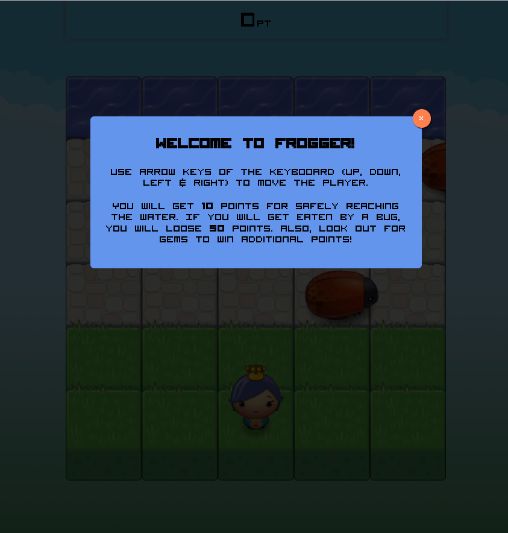
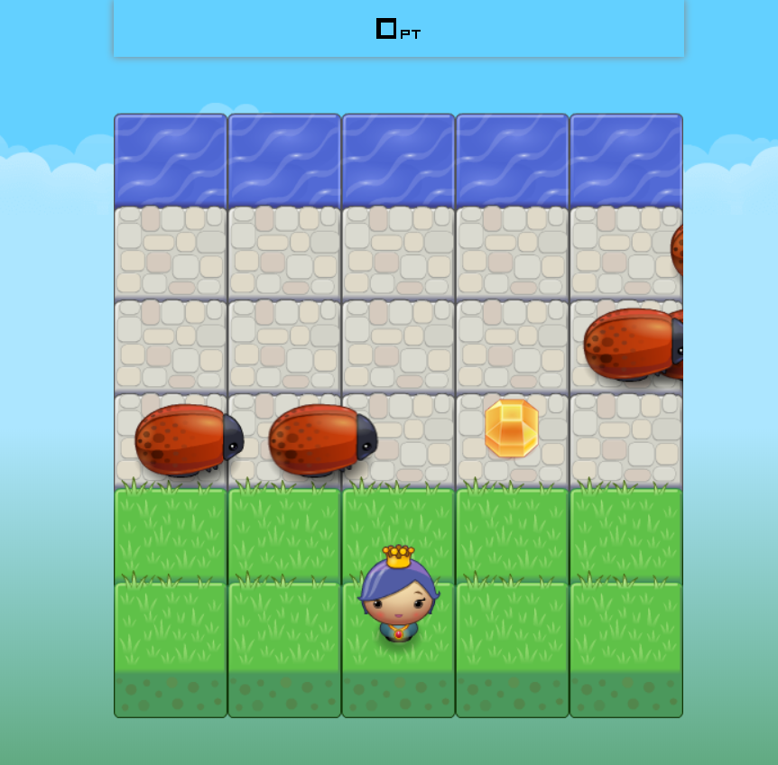

# Frogger Game Project

Frogger Game is a complete browser-based arcade game. But this isn’t just any arcade game! It’s a shnazzy, well-designed, feature-packed game!

You can play the game from [this link](https://htmlpreview.github.io/?https://github.com/ogasimli/udacity-Arcade-Game/blob/master/index.html).

## Table of Contents

* [Game Rules](#game-rules)
* [Technical](#technical)

## Game Rules

In this game there is a Player and Enemies (Bugs). The goal of the player is to reach the water, without colliding into any one of the enemies.

The player can move left, right, up and down using keyboard's arrow keys. The enemies move in varying speeds on the paved block portion of the scene. Once a the player collides with an enemy, the player moves back to the start square and loses 50 points. Once the player reaches the water 10 points are added to the score.

Additionally there are 3 types of gems (blue gem is 20 points, orange gem is 30 points & green gem is 50 points) that player can collect to get bonus points:

* **blue gem** - 20 points
* **orange gem** - 30 points
* **green gem** - 50 points

**Game intro**

**Game board**

## Technical

This game is built as an npm project and mainly consists of the following assets:

* **index.html** - contains the game's html structure.
* **style.css** - contains the game's board styling.
* **app.js** - contains all the board actions & logic.
* **engine.js** - provides the game loop functionality.
* **resources.js** - provides utility functions for loading game assets.

Please follow below instructions to run the project in your machine:

1. Download repository to your local disk
2. Open terminal and navigate to the project folder
3. Run `npm start` command from terminal